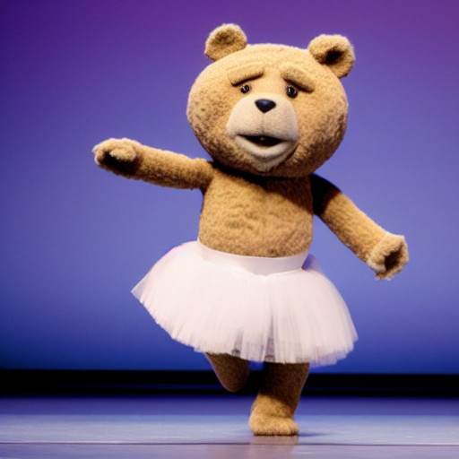
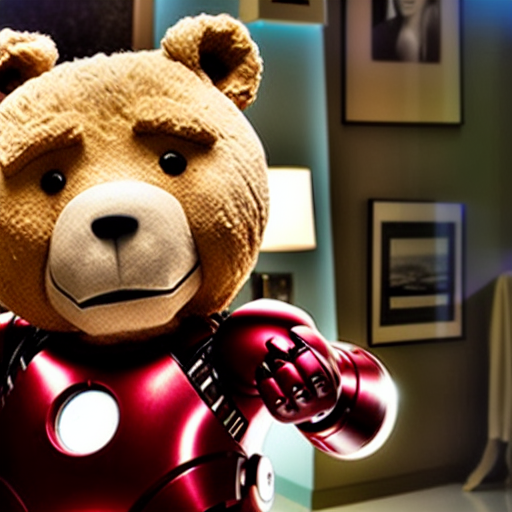
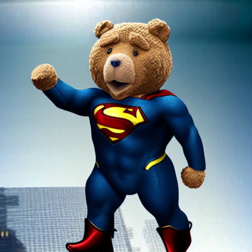

# Micro models

Micro models allow training quickly on a small data set in minimal time.  The technique is simply training on the new data with no preservation.  If you add too much data or train for too long you will damage the model notably, but it is an easy and quick way to get one character into a model.

To train a micro model, only place one subfolder of 20-50 images into a training root folder

Example:

    /training_samples/ted_bennett/ted_bennett
    /training_samples/ted_bennett/ted_bennett/a close up of ted bennett in a suit and tie.jpg
    etc

Training root in this example will be "/training_samples/ted_bennett" and the extra subfolder is required but can be named anything.

## Example

You can recreate the above model by downloading the dataset or try your own.

Dataset: https://huggingface.co/panopstor/ff7r-stable-diffusion/blob/main/ted_bennett.zip

Model: https://huggingface.co/panopstor/ff7r-stable-diffusion/blob/main/ted_bennett_259step_13minutes.ckpt

Unzip the file into your /training_samples folder.  It will create a subfolder on its own to work with the trainer.

On the command line, use v1-finetune_micro.yaml which is setup for this case.  You may wish to slightly change the REPEATS for your data set, with 31 images and repeasts 50 the output is fairly good and completes in just 13 minutes on an RTX 3090:

    python main.py --base configs/stable-diffusion/v1-finetune_everydream.yaml -t  --actual_resume v1-5-micro.ckpt -n ted --gpus 0, --data_root training_samples\ted_bennett

Prompt is simply "ted bennett"

