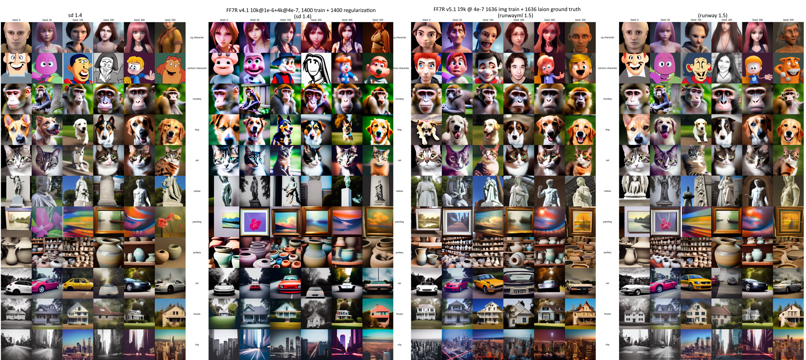
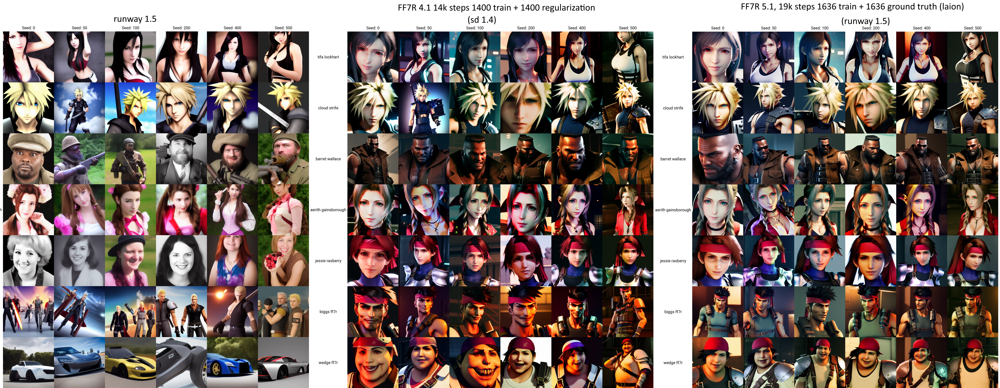
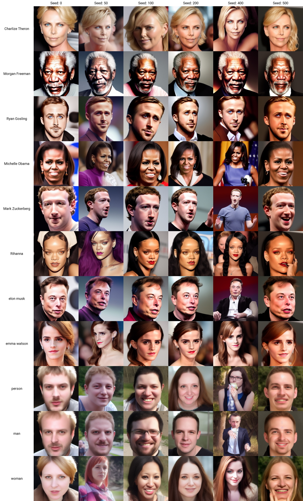

# Final Fantasy 7 Remake model v5.1
This is a finetuning of the RunwayML 1.5 ckpt. 

Info: https://huggingface.co/panopstor/ff7r-stable-diffusion

Model: https://huggingface.co/panopstor/ff7r-stable-diffusion/blob/main/ff7r-v5-1.ckpt

This fine tuning includes over a dozen concepts trained in 1636 images with individual captions on each image, plus 1636 images scraped from the Laion dataset for model preservation. 

See the Hugging Face link for more info and a downloadable model you can try.

Everything should be fairly natural to prompt with the exception of Biggs and Wedge which were trained with "ff7r" as it if were their surname.

## Prompt guide:

### Characters:

    cloud strife
    tifa lockhart
    barret wallace
    aerith gainsborough
    biggs ff7r
    wedge ff7r
    jessie rasberry

### Scenery and objects

    in midgar city
    aerial photo of midgar city
    slums district of midgar city
    backalley of midgar city business district
    business district of midgar city
    train station in midgar city (optionally in a district name from above)
    streets of midgar city (optional in a district name from above)
    shinra security officer holding an assault rifle
    rooftops of the midgar slums district
    food truck in the slums district of midgar
    the bar inside seventh heaven bar

You can mix and match all the above!  Try it out!  There are a few other characters in there but are undertrained for now, but you can try out other names if you are familiar with the game.

Preservation tests.

1.4 is far left, 1.5 far right.

FF7R 4.1 was trained on Kane Wallmann's repo with 1400 images training and 1400 images of regulation generated out of SD itself, similar but not quite equal to dreambooth technique.

FF7R 5.1 was trained on EveryDream with 1636 images training and 1636 images of Laion ground truth without DreamBooth techniques.

(warning huge file!)

These are generated at CFG 7.5, no prompt weighting!

Minimal bleeding in photoreal content. **Improved cropping over even Runway 1.5 in many of the cars and one of the paintings.**  Less bleeding of the Final Fantasy look into "cg character" from 4.1 to 5.1.

New characters tests, these are generated at CFG 7.5, no prompt weighting!

Wedge and Biggs are improved substantially by added data.  Aerith has fewer halos and red shadows compared to 4.1 *without having to lower CFG at inference time.*

Celebrity faces test for FF7R 5.1:

No one looks like a Final Fantasy character, which is what we want.