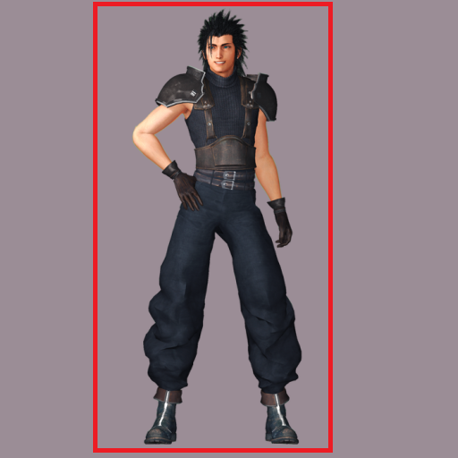
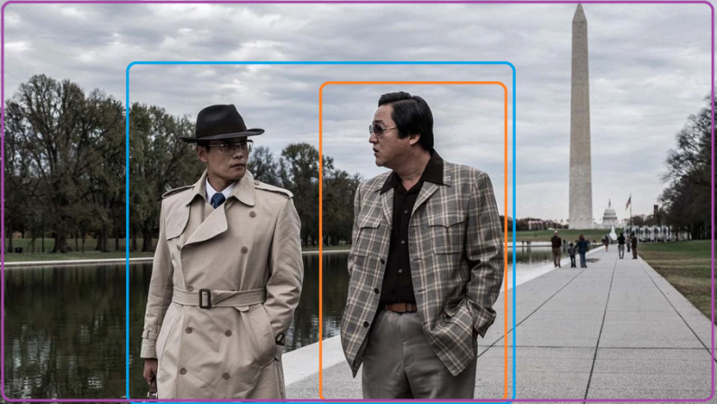

# Data prep and cropping

With the advent of multiple-aspect ratio support, the need for cropping has been reduced. However, there are still some cases where cropping is necessary and advised.

Guidelines for cropping data:
* Crop to the area of interest, i.e. what you want trained, i.e. a face close up if you want, or a full body, etc.
    * ex. if you have a unltra wide screen film still of a person standing in the middle of the frame, crop to just the person
* **1kx1k or ~1300x700 (~1 MP) is recommended as minimum especially as the tech advances, you will want to have the best quality images you can.**
* If you want to train the entire context, like the old west town behind the person, you may wish to also keep a copy of the whole frame, but with a different caption to better describe the whole context, and sort of get two images out of one. 
* Crop out context you don't need or want trained, or junk on the edges that may be hard to describe in the caption, watermarks, logos, etc.
* The trainer handles the rest for you. Do not get wrapped up in the details of the cropping.  Don't worry about precise this or that size.  Do not try to outsmart the code.  Just crop to the area of interest and let the code do the rest.
* If you are training a person or character and what high fidelity faces, you can crop down to just the face.  You want a good number of good face closeups to train a person. All above tips still apply, particularly for total size after cropping. Do not crop a face down to 400x400, it will just reduce quality and blur your character out.

Guidelines for balancing data:
* When training multiple characters or people you need to balance the number of images per character.  Doesn't have to be exact, but should be close.
* Ex. If you have 100 images of Person A and 50 images of Person B, you will find that you either overtrain Person A or undertrain Person B.
* You can try to compensate by creating extra copies of the images of Person B, but this is not ideal. It is better to get more images of Person B.

Model preservation: 
* Model preservation involves throwing in an assortment of other ground truth images to keep the model from overtaining on your actual training data.
* Use the tools repo to search and scrape Laion, use FFHQ dataset, use Google Image Search, use ImageNet, IMDB-wiki, etc. There are many sources of images to use for preservation.
* You should try to "reflect" the nature of the training data.  I.e. if you hare training 4 video game characters and also images of the cityscapes from the game, I suggest you source Laion or FFHQ datasets to get photos of real people, maybe a few paintings of people, and also grab some images of real photos of cityscapes that are photographed in a simlar way to your screenshots.  I.e. street level photos, aerial photos, etc. This will help the model preserve the cityscapes that are already in the model along with the ability of the model to draw real humans.
* You may wish to train without preservation first to see the effect on model preservatoin. You may not damage the model as much as you think. 
* You do not necessarily need 1 preservation image for every training image.  Try using just 15-20% of your training images for preservation as a start.  If you feel it is affecting the model too much you can increase from there.
* There is nothing "different" about how preservation images are treated vs training images in the trainer.  You just put in your data_root folder.  See main README for tips on how to organize subfolders, but your organization and folder structure is for your own benefit, the trainer does not care.

Crop Examples:

Since there isn't much going on here, crop to the red box to get the fully body. This should be at least, say, 768x448 AFTER you crop, but larger is going to be better long term as the tech advances, and there's no drawback but a small amout of disk space to just keep things larger.

This could be cropped a few ways.  Just the orange box to capture the man in the checker jacket, or the blue box to get both men, or the entire scene.

These would be captioned different.  

ex orange: "a man in a checker jacket with his hands in his pockets wanting on a sidewalk with a pond in the background, wearing sunglasses looking to his side"

ex blue: "two men walking together on a sidewalk with a pond and trees in the background"

ex purple: "two men walking in washingon, dc looking at each other with the washington monument in the background and the lincoln memorial reflection poon behind them, film still"

Again, make sure AFTER you crop and properly caption what is left you still have enough resolution.  If the original image isn't big enough, the smaller crops may be insufficient and should be avoided.  