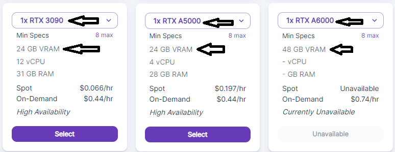
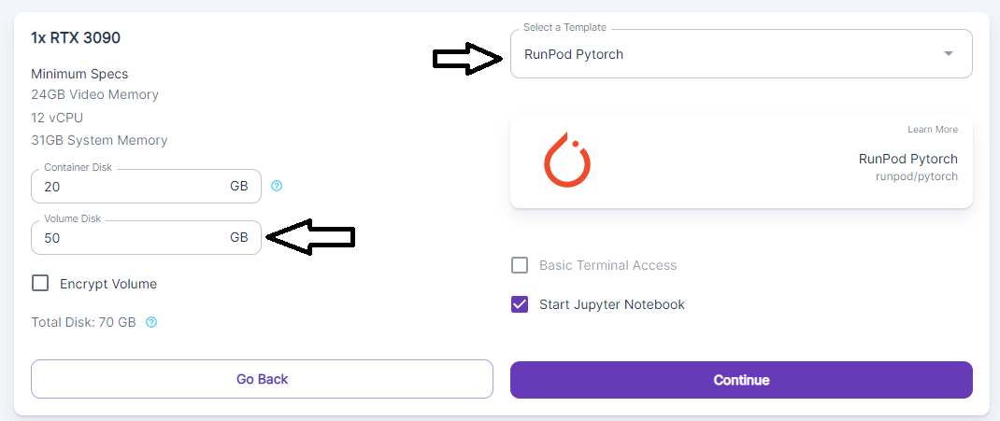
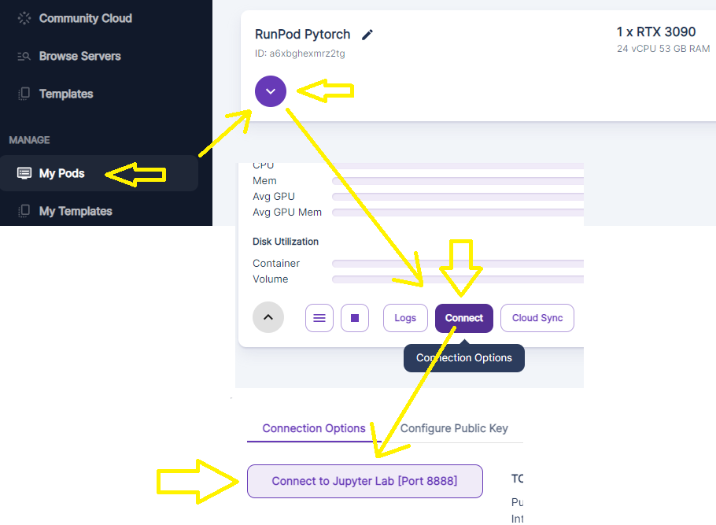
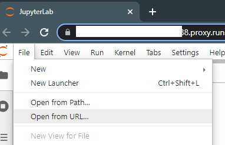
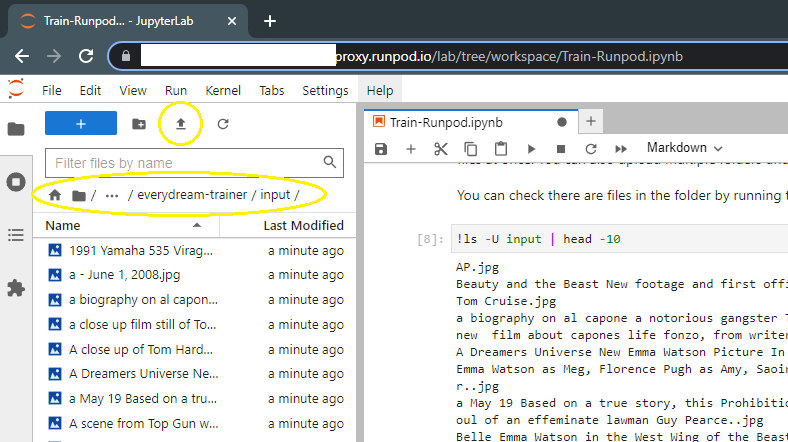
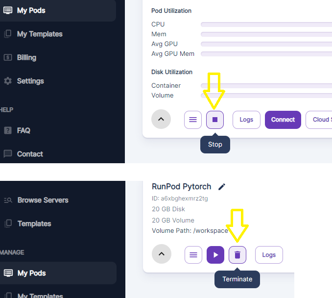

# Runpod

You will need your data prepared first before starting!  Don't waste rental fees if you're not ready to upload your files.  Your files should be captioned before you start with either the caption as the filename or in text files for each image alongside the image files.  See main README.md for more details. Tools are available to automatically caption your files on a 4GB GPU or Colab notebook.

[Main readme](https://github.com/victorchall/EveryDream-trainer/blob/main/README.md)

You can sign up for Runpod here (*shameless referral link*): [Runpod](https://runpod.io?ref=oko38cd0)

If you are confused by the wall of text, join the discord here: [EveryDream Discord](https://discord.gg/uheqxU6sXN)

Make sure you have at least 50GB of Runpod **Volume** storage at a minimum so you don't waste training just 1 ckpt that is overtrained and have to start over.  Penny pinching on storage is ultimately a waste of your time and money!  This is setup to give you more than one ckpt so you don't overtrain.

## Getting started

1. Pick a 24GB GPU instance (community or secure).  You can use 48GB but it is unnecessary.  Make sure to use "ON DEMAND" not "SPOT" or your instance may be closed suddently and you will lose your training. Once you click, go "My Pods" 

1. Start a Pytorch instance in Runpod. Make sure to get plenty of volume space! 

2. Launch the Juypyter notebook. 

3. Click file, open from URL, and paste in this URL: https://raw.githubusercontent.com/victorchall/EveryDream-trainer/main/Train-Runpod.ipynb 

4. Rest of the instructions are in the notebook, but you'll upload your files here once ready:

5.  Make sure to go back to Runpod.io when you are done (don't forget to download your PRUNED.CKPT files) and STOP your instance and also click the **trash can button** to remove the volume storage.  You will be charged for the storage if you don't delete it.  

# Advanced mode

You can train MUCH larger models with more data, potentially unlimited numbers of characters and styles into one model.  You will follow the same steps, but the expectation is you are using a much larger data set, say, many hundreds or thousands of images, and are willing to train for many hours.  There are many things to consider on each project and different projects have different requirements so it is hard to generalize.

You can read up on a model trained with 7+ characters and a variety of cityscapes using 1600+ new training images and 1600+ preservation images here: [FF7R Mega Model on Huggingface](https://huggingface.co/panopstor/ff7r-stable-diffusion)

You will want even more volume space.  100GB is advised so you can get MANY ckpts (many epochs) you can test along the way, download them, stop your instance, test, and resume from them again if needed.  This will save you a lot of heartache with undertrained or overtrained models, especially if you are training for 6-10+ hours.

You will change the yaml in the training step to v1-finetune-everydream.yaml, and also want to consider tweaking the values and a long, careful read of the main README, and training more basic models first.

    !python main.py --base configs/stable-diffusion/v1-finetune_everydream.yaml -t  --actual_resume "v1-5-pruned.ckpt" -n test --data_root input

This file is configured better for very large training sets.  Repeats is reduced.